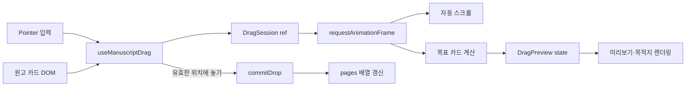
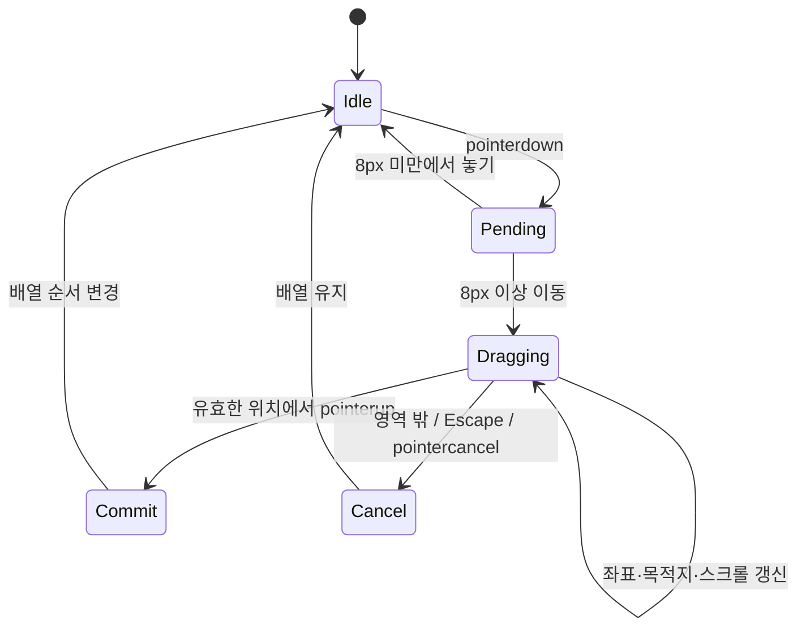
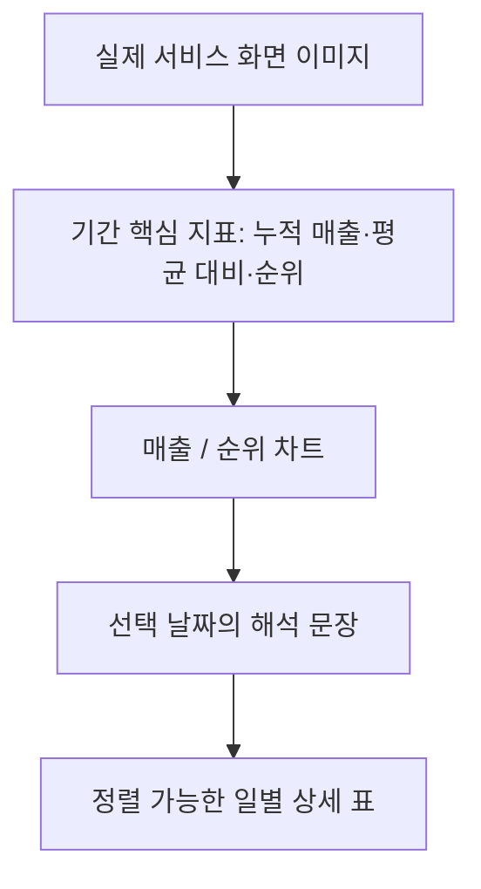

# 포트폴리오 인터랙티브 데모 구조

이 문서는 오늘의웹툰 원고 정렬과 웹툰 메트릭 지표 차트 데모의 구현 구조를 설명한다. 두 데모는 실제 제품 경험을 웹에서 이해하기 쉽게 재구성한 샘플이며, 실제 서비스 데이터나 전체 기능을 복제한 화면은 아니다.

## 원고 이미지 정렬

### 설계 목표

- 마우스·펜은 원고 이미지 또는 손잡이에서 드래그한다.
- 터치는 페이지 스크롤과 충돌하지 않도록 손잡이에서만 드래그한다.
- 드래그 중 실제 배열은 유지하고, 유효한 위치에 놓을 때 한 번만 순서를 확정한다.
- 첫 장에서 마지막 장까지 여러 행을 지나 이동할 수 있다.
- 영역 밖 드롭, `Escape`, 포인터 취소, 창 포커스 상실은 원래 순서를 유지한다.
- 방향키와 앞·뒤 버튼을 별도 조작 경로로 제공한다.

### 구성



`ManuscriptDemo.tsx`는 원고 데이터, 업로드, 삭제, 실제 순서와 UI를 담당한다. `useManuscriptDrag.ts`는 입력 세션, 좌표, 목적지, 자동 스크롤과 종료를 담당한다. `site.module.css`는 원래 자리, 이동 미리보기, 목적지 강조와 삽입선을 표현한다.

### 상태 흐름



`DragSession`은 자주 바뀌지만 화면을 직접 바꾸지 않는 최신 포인터 좌표를 `ref`에 보관한다. `DragPreview`는 화면에 필요한 미리보기 위치와 목표 순번을 React state로 전달한다. 이 분리로 포인터 이벤트마다 바로 렌더링하지 않고 브라우저의 화면 갱신 주기에 맞춰 표시를 바꾼다.

### 좌표와 목적지 계산

포인터 위치는 `clientX/clientY`, 카드 위치는 `getBoundingClientRect()`, 미리보기는 `position: fixed`를 사용한다. 모두 뷰포트 좌표이므로 같은 기준에서 계산할 수 있다.

처음 잡은 지점을 유지하기 위해 다음 식으로 미리보기의 왼쪽 위를 구한다.

```text
previewLeft = pointerX - offsetX
previewTop  = pointerY - offsetY
```

목적지는 다음 순서로 결정한다.

1. 포인터가 그리드와 24px 여유 범위 안에 있는지 확인한다.
2. 모든 원고 카드의 사각형과 DOM 순서를 읽는다.
3. 포인터와 세로 거리가 가장 가까운 행을 고른다.
4. 해당 행에서 가로 중심이 가장 가까운 카드를 목표로 고른다.
5. 목표 카드의 최종 순번을 제거 전 배열의 삽입 경계인 `slot`으로 변환한다.

배열 `[A, B, C, D]`에서 A를 D의 순번으로 옮길 때 목표 카드 index는 `3`, slot은 `4`다. A를 먼저 제거하면 배열 길이가 줄기 때문에 컴포넌트는 `slot - 1`, 즉 index `3`에 삽입한다. 결과는 `[B, C, D, A]`가 된다.

### 장거리 이동과 자동 스크롤

진행·종료 이벤트를 `window`의 캡처 단계에서 추적하고, 시작할 때 루트 요소에 포인터 캡처를 설정한다. 따라서 포인터 아래의 카드가 바뀌거나 여러 행을 지나도 같은 세션이 유지된다.

포인터가 화면 위·아래 80px 구간에 들어가면 거리에 비례해 최대 초당 600px의 속도로 페이지를 스크롤한다. 스크롤 뒤에는 카드의 뷰포트 좌표가 달라지므로 목적지를 다시 계산한다. 현재 자동 스크롤 대상은 `window`이며, 별도 스크롤 패널을 도입하면 해당 컨테이너를 대상으로 확장해야 한다.

### 시각적 피드백

- 원래 카드는 흐리게 표시해 출발 위치를 남긴다.
- 포인터를 따라오는 복제 미리보기는 실제 목록과 분리한다.
- 목표 카드의 테두리와 순번을 강조한다.
- 이동 방향에 따라 목표 카드 앞 또는 뒤에 삽입선을 표시한다.
- 유효 범위 밖에서는 놓으면 취소된다는 안내를 표시한다.

미리보기에는 `pointer-events: none`을 적용해 입력을 가로채지 않게 한다. 안내 문구에는 최소 높이를 두어 문구가 달라져도 목록 위치가 움직이지 않게 한다.

## 웹툰 메트릭 차트

### 화면의 정보 구조



프로젝트 개요에는 실제 포트폴리오에 수록된 서비스 화면을 배치하고 원본 크기로 열 수 있게 했다. 인터랙티브 차트는 가상 데이터로 동작 원리를 보여주는 보조 자료다. 실제 화면과 샘플 수치를 가까이 두되, 캡션과 배지로 출처를 구분한다.

날짜 range 입력은 스크롤 중 우연히 값이 바뀌는 문제가 있어 제거했다. 마우스로 차트를 가리키거나 일별 표의 날짜를 선택하면 값이 바뀐다. 터치 포인터의 이동은 차트 선택에 반영하지 않아 세로 스크롤과 충돌을 줄인다.

### 지표별 표현

- 매출: 작품 매출과 장르 평균을 같은 축에서 비교하고 영역 채우기를 제공한다.
- 순위: 작은 숫자가 위에 오도록 Y축 방향을 뒤집는다.
- 요약: 14일 누적 매출, 장르 평균 대비 비율, 첫날 대비 순위 상승을 먼저 보여준다.
- 표: 날짜 또는 작품 값으로 정렬하며 선택한 날짜를 강조한다.

차트는 React와 SVG로 재구성했다. 실제 제품에서 사용한 D3 기반 공통 차트의 역할과 지표별 표현 결정을 설명하기 위한 예시다. 문서와 화면의 수치는 모두 가상이며 실제 성과로 인용하면 안 된다.

## 유지보수 위치

| 목적 | 파일 |
|---|---|
| 원고 데이터와 화면 | `components/portfolio/ManuscriptDemo.tsx` |
| 드래그 입력과 좌표 계산 | `components/portfolio/useManuscriptDrag.ts` |
| 차트 데이터와 SVG·표 | `components/portfolio/ChartDemo.tsx` |
| 프로젝트 내용 | `components/portfolio/content.ts` |
| 데모 스타일 | `components/portfolio/site.module.css` |

상수를 바꿀 때는 조작감뿐 아니라 모바일 스크롤, 그리드 행 수, 영역 밖 취소와 접근성 경로를 함께 확인한다. 실제 제품의 기능이나 측정하지 않은 성능 수치를 포트폴리오 설명에 추가하지 않는다.
